## ACTIVE
Çözülecek olan zafiyetli makine, Hack The Box Pen-Test Labs (www.hackthebox.eu) laboratuvarında yer almaktadır. Makine adı: Active.
İlk olarak makinenin IP adresi ile **nmap** aracını kullanarak port taraması gerçekleştirildi.  Nmap aracına *-sS* parametresi eklenerek SYN taraması ve *-sV* parametresi eklenerek servisler için güncel versiyon taraması yapıldı. Sonuçlar Resim 1'de görülmektedir.

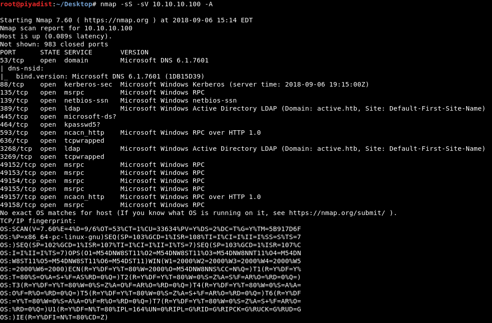

Resim 1 - Port Taraması

Makinede, bir Windows işletim sistemi versiyonu kurulu olduğu tespit edildi. Açık portlar arasından, makineye sızmak amacı ile kullanılabilecek alternatif bir protokol olan SMB protokolünün 445. port üzerinde çalıştığı tespit edildi. SMB (Server Message Block) protokolü; ağdaki yerel dosyalara erişmek amacı ile tasarlanmıştır. Bu protokol Windows tarafından;
  - Ağdaki diğer Microsoft SMB Protokolü sunucularını belirleme
  - Ağ üzerinden yazdırma
  - Dosya izin paylaşma ve kimlik doğrulama
  - Kilitleme ve dosya kaydetme
  - Dosya ve Dizin Değişikliği Bildirimi
  - Genişletilmiş dosya özniteliği işleme
 işlevleri için kullanılmaktadır.

Dosya paylaşma ve kimlik doğrulama özelliğinden yola çıkılarak, paylaşıma açık dosyalara erişelebilir ya da uzaktan kimlik doğrulama işlemi gerçekleştirilebilir.

Makinede SMBv2 kullanıldığı tespit edildi.

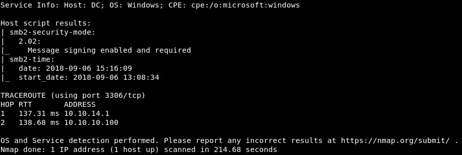

Resim 2 -SMB versiyon

"enum4linux" aracı SMB protokolü ile bir makineye ait;
  - Domain bilgileri
  - Paylaşıma açık dosyalar
  - Açık oturumlar
  - İşletim sistemi özellikleri
  - Domain'e ait SID bilgisi
  - Gruplar
  - Yazıcılar
  - RID bilgisi
hakkında bilgi vermek amacıyla kullanılmaktadır.

Resim 3' te görüldüğü üzere, KALI komut satırı üzerinden **enum4linux 10.10.10.100** komutu
ile araç çalıştırıldı.

Resim 3 - Enum4Linux

Çıkan sonuçlara göre, paylaşıma açık dosyalar listelendi ve bu dosyalar arasından herhangi bir kimlik bilgisi girilmeden **Anonymous** olarak erişilebilen **Replication** dizini tespit edildi.

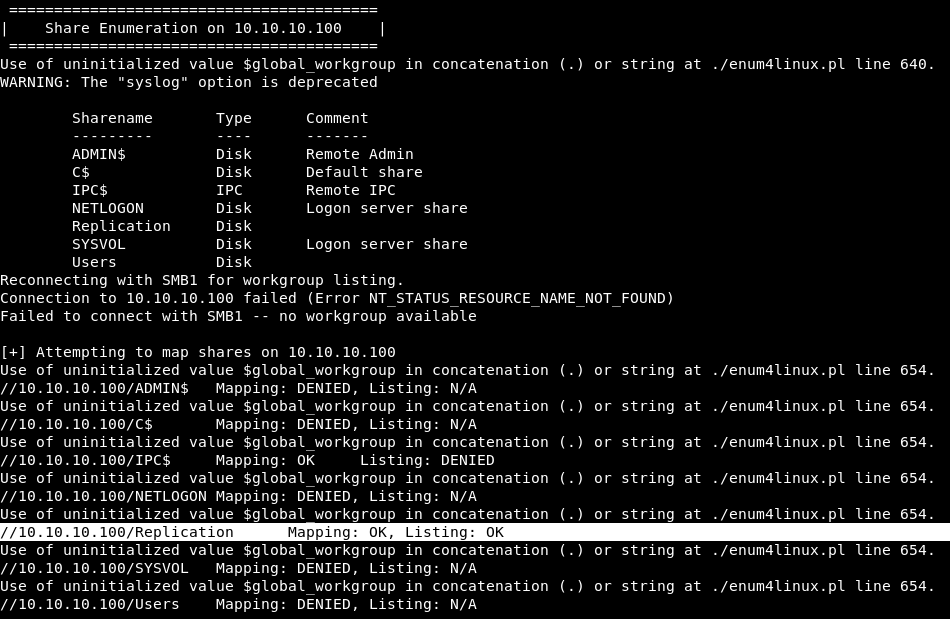

Resim 4 - Paylaşıma açık dosyalar

**smbclient** aracı kullanılarak Replication dizinine erişildi.

**smbclient //10.10.10.100/Replication**

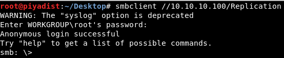

Resim 5 - Smbclient

Replication dizini içerisinde bulunan dosyalar ve dizinler incelendi. **//10.10.10.100/Replication/active.htb/Policies/{31...F9}/MACHINE/Preferences/Groups** yolu içerisinde, **Groups.xml** adlı bir dosya bulundu.

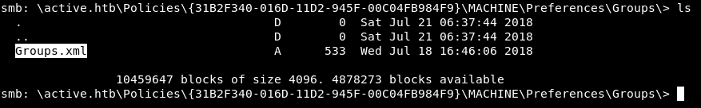

Resim 6 - Groups.xml

Bu dosya **SYSVOL** adlı paylaşılan dizine ait bir dosyadır. SYSVOL dizini içerisinde Group Policy'e ait bilgiler tutularak paylaşıma açılır ve erişim bu dizin ile sağlanır. SYSVOL dizinine erişmek için kimlik bilgisi kullanılır ve bu bilgiler Groups.xml içerisinde, açık metin olarak **userName** ve AES standartında şifrelenmiş olarak **cpassword** isimleri ile saklanır.

Groups.xml dosyası okunarak içerisinde yazan bilgiler listelendi.

**more Groups.xml**

Resim 7 - Groups.xml

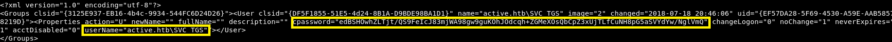

Resim 8 - Groups.xml içeriği

Groups.xml içerisinde, yer alan bilgilere göre SYSVOL kullanıcı adı **SVC_TGS** ve bu kullanıcının şifreli parolası **edBSHOwhZLTjt/QS9FeIcJ83mjWA98gw9guKOhJOdcqh+ZGMeXOsQbCpZ3xUjTLfCuNH8pG5aSVYdYw/NglVmQ** olarak tespit edildi. Bu parolanın çözülmesi için bir **key (anahtar)** gerekmektedir. Bu anahtar Microsoft tarafından

 **https://msdn.microsoft.com/en-us/library/2c15cbf0-f086-4c74-8b70-1f2fa45dd4be.aspx**

 linkinde yayınlanmıştır.

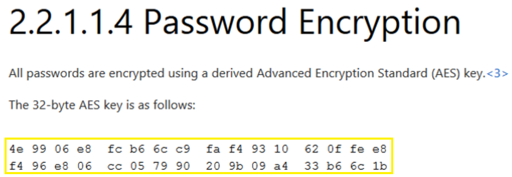

Resim 9 - SYSVOL Şifreli Parolanın Anahtarı

Bu anahtarı kullanarak şifreli parolayı çözen **gp3finder.exe** adlı bir uygulama bulunmaktadır. Uygulamayı **https://bitbucket.org/grimhacker/gpppfinder** linkinden indirebilirsiniz. Bu uygulama kullanılarak parola çözüldü ve **GPPstillStandingStrong2k18** olarak elde edildi.

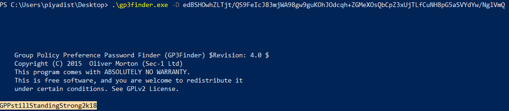

Resim 10 - SYSVOL Açık Metin Parola

Smbclient programı ile, SVC_TGS adlı kullanıcı üzerinden **Users** dizinine erişildi.

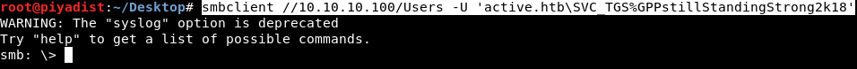

Resim 11 - SYSVOL Kullanıcı Erişimi

Desktop dizinine gidilerek **user.txt** adlı dosyaya erişilde ve bu dosya okunarak **Own User Flag** elde edildi.

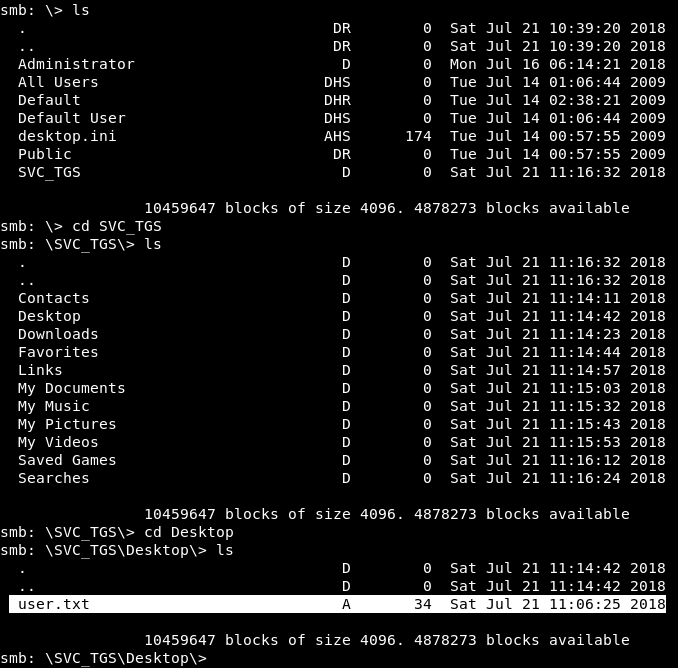

Resim 12 - user.txt

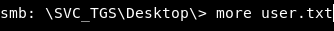

Resim 13 - user.txt

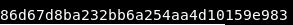

Resim 14 - Own User Flag

user.txt dosyası okunduktan sonra, Own System Flag'e erişebilmek için hak yükseltme işlemi gerekmektedir. Bunun için **Impacket** adlı araç kullanıldı. Impacket, içerisinde Python programlama dili ile yazılan modüller bulunduran bir araçtır. Bu araç içerisinde sızma ve sızma sonrası işlemler için modüller bulunmaktadır.Aracı,  Bu modüller arasından kullanılabilecek bir modül olarak **GetUserSPNs.py** modülü kullanılabilir. SPN (Servis Principal Name), KDC (Key Distribution Center) üzerinden servis bileti (Ticket Granting Service - TGS) almak amacı ile Kerberos kimlik doğrulama protokolünde kullanılmaktadır. KDC'den bir bilet alınacağı zaman, erişilmek istenen servisi belirtmek amacı ile benzersiz **<NETBIOS name>/<MACHINE name>.<DOMAIN name>:<Servis portu>** formatında (Örnek: MSSQLEXPRESS/DC.piyadist.com:1433) bir SPN KDC'e bildirilir ve bilet alınır. GetUserSPNs.py modülü, normal bir kullanıcı hesabı ile SPN'leri ve TGS biletine ait bilgilerin özetini (hash) vermektedir. GetUserSPNs.py modülü çalıştırıldı. Resim 15'te görüldüğü üzere **Administrator** kullanıcısına ait bir SPN bilgisi bulunmaktadır. Dolayısıyla buradan yola çıkılarak hak yükseltme işlemi gerçekleştirilebilir.

**./GetUserSPNs.py -request -dc-ip 10.10.10.100 active.htb/SVC_TGS**
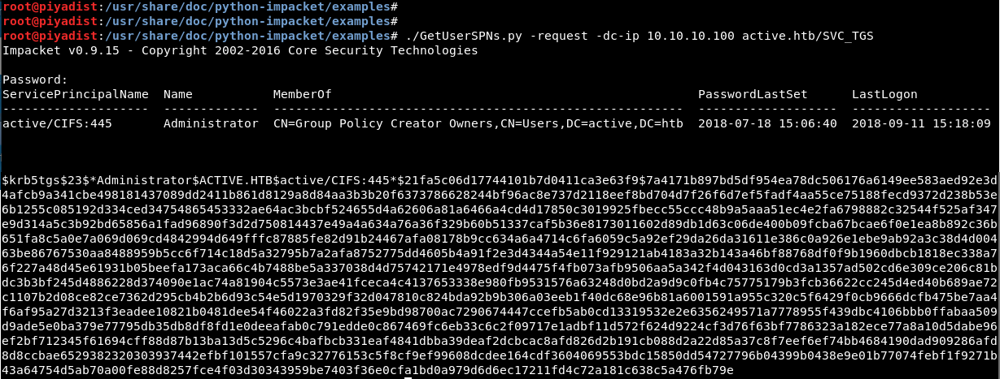

Resim 15 - Own User Flag

Özet verinin içerisinde Administrator kullanıcısına ait NTLM hash ve salting değerleri de bulunmaktadır. Buradan yola çıkarak bir metin listesi ile açık parola elde edilebilir. Bunun için **hashcat** uygun bir programdır. Hashcat birçok hash tipinin çalışma mantığını bilerek, ona göre karşılaştırma yapabilmektedir. Hashcat programının adını yazarak **-m** arametresi ile **13100** değeri verildi. Bu parametre değeri Kerberos TGS özetini temsil etmektedir. Düzgün bir atak gerçekleştirmek için **-a** parametresine **0** değeri atandı. Hash değerinin kayıtlı olduğu **tgs.txt** belirtildi. Parola listesi olarak , popüler bir liste olan **rockyou.txt** belirlendi ve program çalıştırıldı.

**hashcat -m 13100 -a 0 tgs.txt /usr/share/wordlists/rockyou.txt --force**

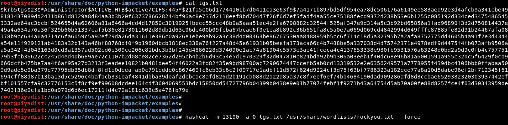

Resim 16 - Hashcat

Resim 17 - Hash modu

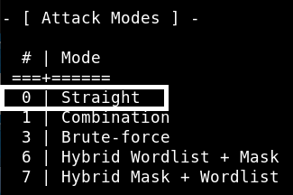

Resim 18 - Atak Modu

Resim 19'da görüldüğü üzere Administrator hesabına ait parolanın **Ticketmaster1968** olduğu tespit edildi.

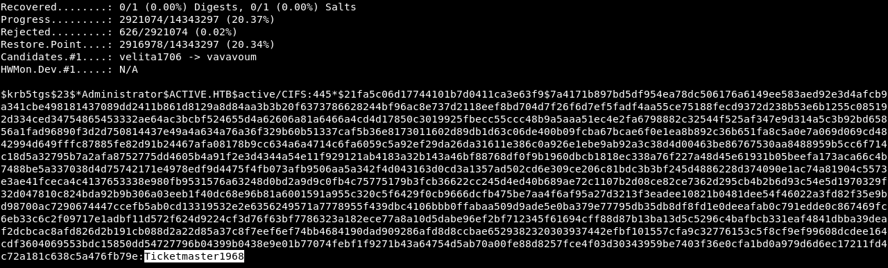

Resim 19 - Administrator parola

Sisteme, Administrator hesabı ile bir shell alarak erişmek için, metasploit uygulamasına ait olan **psexec** modülü seçildi. Psexec, Windows Domain Controller makinenin diğer makinelerde komut çalıştırabilmesini sağlayan bir uygulamadır. Sisteme erişim amacıyla kullanılacak olan bu modül daha çok **Pass-the-Hash** saldırılarında kullanılmaktadır. Bu modülü kullanarak sisteme erişebilmek için; **RHOST, RPORT, SHARE, SMBDOMAIN, SMBUSER, SMBPASS** parametrelerinin doğru bir şekilde değer almaları gerekmektedir. Ardından bir **PAYLOAD** belirlenerek sisteme erişim metodumuz belirlenecektir. Böylece modülün çalıştırılması ile beraber makinede **powershell.exe** uygulaması çalışacak ve bu uygulama oturum bağlantısı sağlayacaktır.

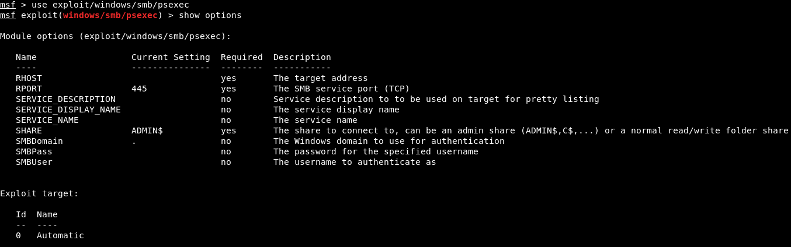

Resim 20 - SMB Psexec

Gerekli bilgiler verildi ve oturum bağlantısı sağlaması amacı ile PAYLOAD olarak **windows/meterpreter/reverse_tcp** modülü seçildi ve modüle ait olan LHOST ve LPORT parametrelerine yerel IP adresi ve port numarası parametreleri atandı.

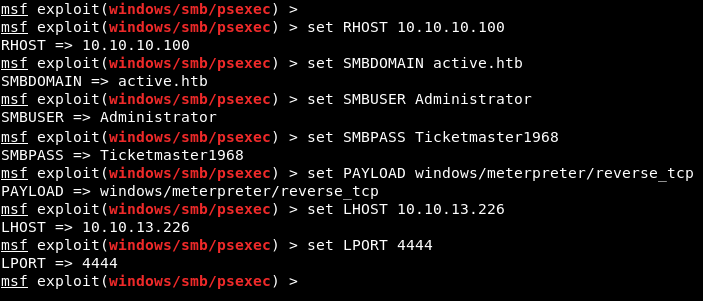

Resim 21 - SMB Psexec Parametre Değerleri

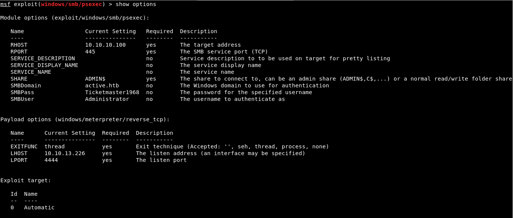

Resim 22 - SMB Psexec Parametre Değerleri

**exploit** komutu ile sızma işlemi başlatıldı ve bir **meterpreter** bağlantısı elde edildi. **getuid** komutu ile oturumun hangi hesap ile elde edildiği görüntülenebilir. Resim 23'de görüldüğü üzere oturum bağlantısı, en yetkili kullanıcı olan **NT AUTHORITY/SYSTEM** hesabı ile elde edildi.

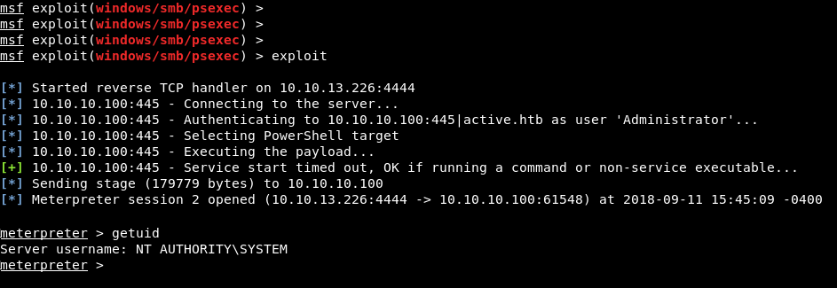

Resim 23 - Meterpreter Oturumu

Administrator hesabına ait dizin içerisinde bulunan **Desktop** dizinine gidilerek **cat root.txt** komutu ile root.txt dosyası okunarak, **Own System Flag** elde edildi.

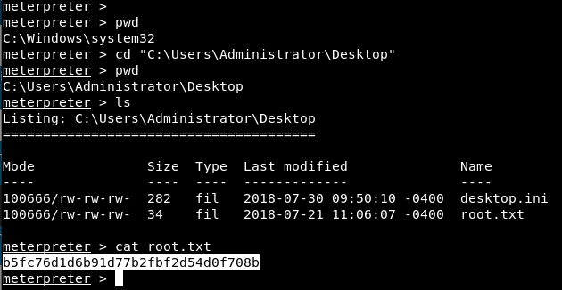

Resim 24 - Own System Flag
