## BOUNTY
İlk olarak makinanın IP adresi ile **nmap** aracını kullanarak port taraması gerçekleştirildi.  Nmap aracına *-sS* parametresi eklenerek güncel servis taraması ve *-sV* parametresi eklenerek servis için güncel versiyon taraması yapıldı. Çıkan sonuca göre , 80 numaralı portun açık olduğu ve bu portun, Microsoft IIS web sunucusu tarafından kullanıldığı tespit edildi.

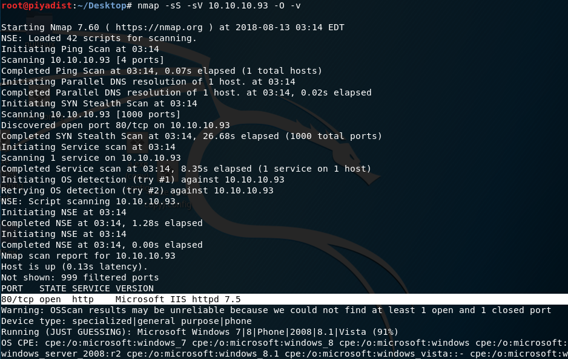

Resim 1 - Port Taraması

Açık olan 80 numaralı port, bir web sunucusu tarafından kullanıldığı için tarayıcı üzerinden istek gönderildi ve bir web sayfası ile karşılaşıldı.

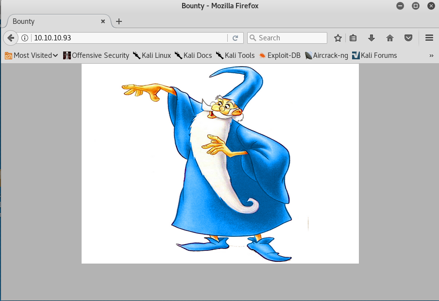

Resim 2 - Web Sayfası

Web sunucusu içerisinde başka dosyaların ve klasörlerin olabileceği düşünülerek, **dirbuster** uygulaması çalıştırıldı.

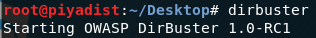

Resim 3 - Dirbuster

 Bu uygulamaya web sunucusunun *IP adresi*, *IIS portu* ve sunucuda bulunan web sayfaları ve klasörlerin bulunması adına **brute force** yönteminin kullanılması için *wordlist dosyası bilgileri* ve IIS sunucusu çalıştığı için işimize yarayacak dosyaların **aspx** uzantılı olabileceği düşünülerek "File Extension" kısmına *aspx* değeri verildikten sonra işlem başlatıldı.

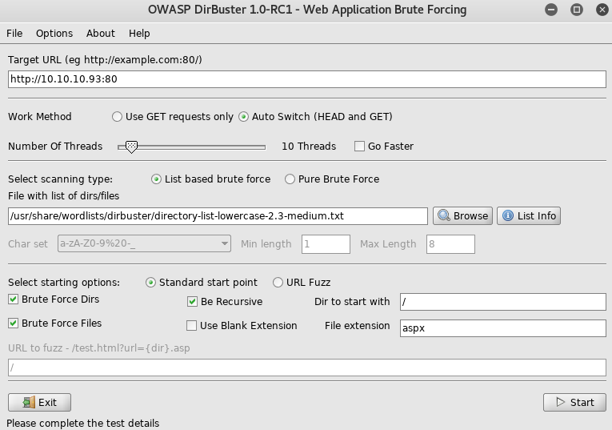

Resim 4 - Dirbuster Dosya ve Klasör Bulma İşlemi

İşlem sonucunda dosya transfer edebileceğimiz **transfer.aspx** adlı dosya ve yüklenen dosyaların tutulduğu **uploadedfiles** adlı klasör bulundu.

Resim 5 - İşlem Sonuçları

transfer.aspx sayfası açıldı ve bir upload nesnesi ile karşılaşıldı.

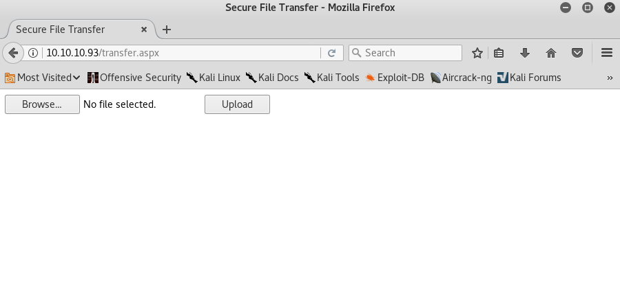

Resim 6 - transfer.aspx

Bu upload nesnesi ile shell almak amaçlı bir dosya yüklenilebileceği düşünülerek, **uzak komut çalıştırma (Remote Code Execution)** istismarının kullanılabilmesi imkanını sağlayan, **config** uzantılı, *web.config* adlı bir dosya yüklendi.

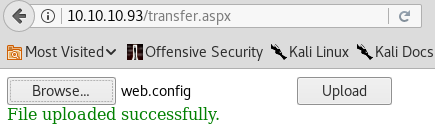

Resim 7 - web.config

Yüklenen dosyalar *uploaedfiles* adlı klasöre yüklenmektedir. Bu nedenle tarayıcı üzerinde, adres çubuğuna /uploadedfiles/web.config yolu yazılarak, web.config dosyasının sağladığı sayfaya erişildi. Erişilen bu sayfada bir adet metin kutusu bulunmaktadır. Bu kutuya, shell alınabilecek bir zararlı komut yazılarak çalıştırılabilir.

NOT: Bu sayfada işlem gerçekleştirmek için acele edilmesi gerekmektedir. Yüklenilen dosyalar 30 saniyede bir silinmektedir.

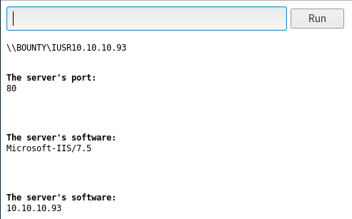

Resim 8 - /uploadedfiles/web.config

Arayüzde bulunan metin kutusuna zararlı bir komut yazılıp, çalıştırılması için metasploit-framework uygulamasına ait bir modül kullanıldı. **web_delivery (use exploit/multi/script/web_delivery)** olarak adlandırılan bu modül ile bir payload belirleyerek, girilen yerel IP adresi ve port numarasına göre dinleme modu başlamaktadır.

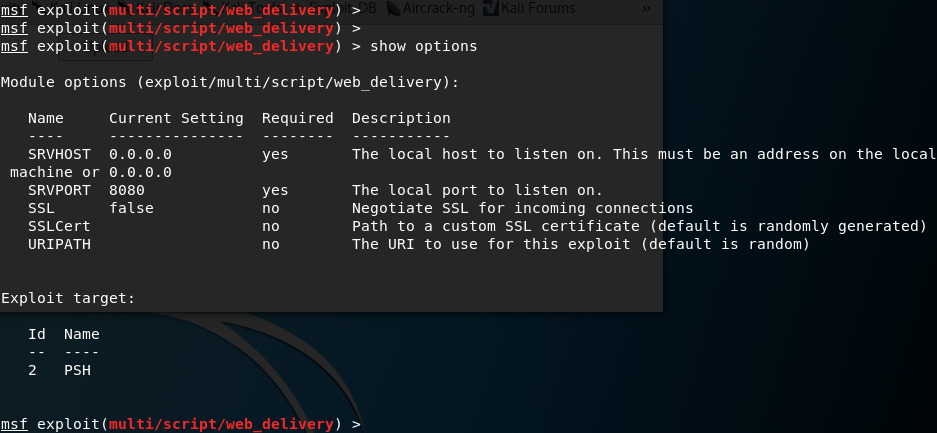

Resim 9 - web_delivery modülü

Dinleme modunun başlaması ile birlikte, web arayüzünde zararlı kod çalıştırmak amacı ile kurban makinede bir oturum elde edilmesi için Python,Powershell,PHP ve Regsvr32 formatlarında zararlı kod üretilmektedir. Bu durumlar baz alınarak, kurban makinede oturum elde edilip, bu oturumu kontrol etmek adına meterpreter adlı komut satırı uygulamasını çalıştırmak için **windows/meterpreter/reverse_tcp** adlı payload belirlendi. Bu payload'a ait parametrelerden olan **LHOST** parametresine dinleme modu için **yerel IP adresi** ve **LPORT** parametresine dinleme işleminin kullanacağı **port numarası** değerleri atandı. Kurban makinede bir Windows işletim sistemi versiyonu kurulu olduğu için, modulün desteklediği formatlardan en uygun olan powershell formatında kod üretmek için **TARGET** parametresine **PSH (powershell)** değerini temsil eden **2** değeri atandı.

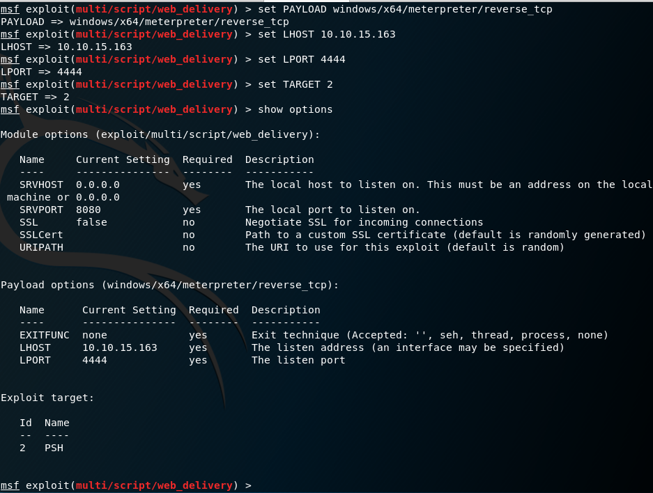

Resim 10 - Parametrelere değer atanması

Değerler atandıktan sonra **exploit -j** komutu ile dinleme modu başlatıldı ve zararlı powershell komutu üretildi.

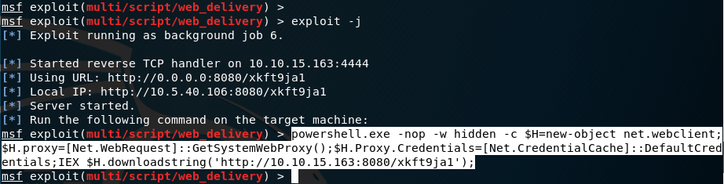

Resim 11 - Zararlı powershell komutu

Upload sonucu elde edilen web sayfasına gidilerek, metin kutusunun içerisine zararlı powershell komutu yazıldı ve *Run* butonuna basılarak kod çalıştırıldı.

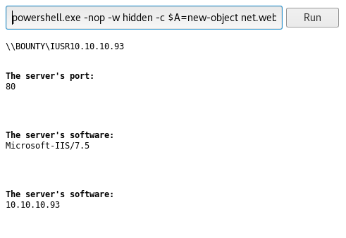

Resim 12 - Zararlı powershell komutu

Çalıştırılan bu komut sonrasında, dinleme modu açılan Kali Linux makinede, web_delivery modülü üzerinden **meterpreter** oturumu elde edildi.

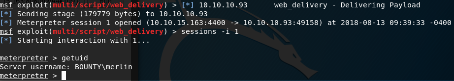

Resim 13 - Meterpreter oturumu

Resim 13'de görüldüğü üzere *getuid* komutu çalıştırılarak, sisteme **BOUNTY\merlin** adlı hesabın hak ve yetkileri ile erişildiği anlaşıldı. Hack the Box formatı gereği **merlin** kullanıcısına ait bir *flag* dosyası olacağı düşünülerek, bu kullanıcıya ait *Desktop* dizinine erişildi ve dizin içerisinde bulunan dosyalar listelendi. Listelenen dosyalar arasında bulunan **user.txt** adlı dosyanın içeriği *cat* komutu ile okundu ve kısıtlı yetkilere sahip **merlin** adlı kullanıcı ile **Own User Flag** elde edildi.

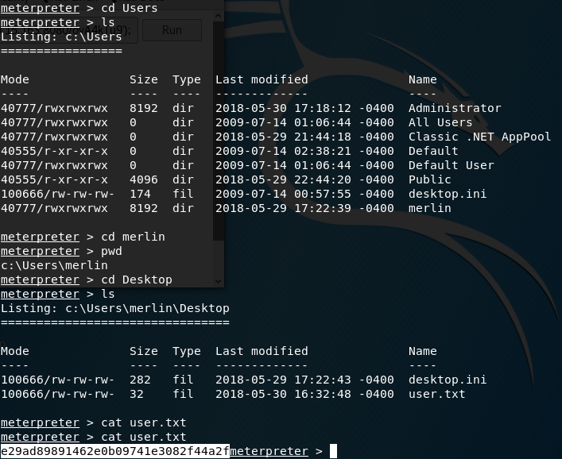

Resim 14 - Own User Flag

*Own System* için flag dosyasını okumak amacıyla hak yükseltme(privilege escalation) işlemi gerçekleştirilmelidir. Bunun için meterpreter komut satırı üzerinde **getprivs** komutu ile merlin kullanıcısına ait yetkiler görüntülendi. Bu yetkiler arasında işe yarayabilecek olan 2 adet hak dikkat çekmektedir: **SeImpersonatePrivilege** ve **SeAssignPrimaryTokenPrivilege**. Bu haklar sayesinde servis hesapları, yeri geldiği zaman, en yetkili **NT AUTHORITY\SYSTEM** hesabına ait token ile yüksek yetki gerektiren işlemler gerçekleştirebilmektedir. Bu yöntem ile NT AUTHORITY\SYSTEM hesabına ait token elde edilerek hak yükseltme işlemi gerçekleştirilebilir. Bunun için **Potato.exe** adlı bir uygulama bulunmaktadır. Bu uygulama ile NT AUTHORITY\SYSTEM hesabına ait token elde edilerek, merlin kullanıcısının sahip olduğu SeImpersonatePrivilege ve SeAssignPrimaryTokenPrivilege hakları sayesinde, NT AUTHORITY\SYSTEM hesabına hak yükseltilebilir.

Hak yükseltme işlemi için Potato.exe uygulaması ve bu uygulamanın çalışması için gereken 3 adet .dll uzantılı dosyalar indirildi.

Resim 15 - Potato.exe

Bu 4 dosya, meterpreter oturumu ile, kurban makineye upload edildi.

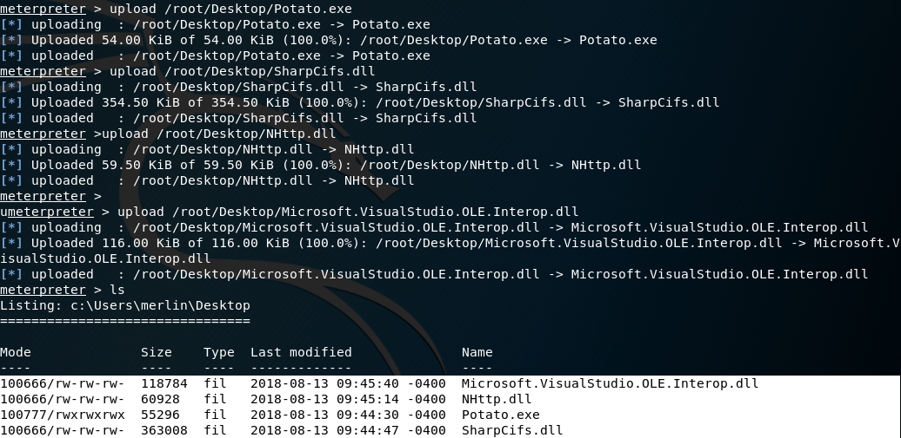

Resim 16 - Dosyaların upload edilmesi

Meterpreter komut satırı üzerinde, **execute -c -f Potato.exe** komutu ile uygulama çalıştırıldı.(-c parametresi kanal oluşturmak, -f parametresi ise process oluşturmak amaçlı kullanılmıştır.)

Token ile geçiş yapılabilecek hesapların görüntülenebilmesi için **load incognito** komutu ile incognito adlı modül yüklendi. (Başka bir hesaba geçiş yapabilmek için meterpreter oturumu üzerinde, **incognito** modülü kullanılır.)

Incognito modülüne ait **list_tokens** komutu, kullanıcı hesaplarını görüntülemek amacı ile **-u (users)** parametresi ile birlikte çalıştırıldı.

Potato.exe sayesinde, gelen listede bulunan **Impersonation Tokens Available** adı altında en yetkili hesap olan **NT AUTHORITY\SYSTEM** hesabı görüntülendi.

**impersonate_token "NT AUTHORITY\SYSTEM"** komutu ile başarılı bir şekilde hak yükseltme işlemi gerçekleştirildi.

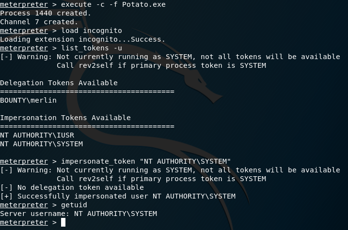

Resim 17 - Hak yükseltme

Sistem üzerinde yetkili olan **Administrator** hesabına ait *Desktop* dizinine erişildi ve dizin içerisinde bulunan dosyalar listelendi. Dosyalar arasında bulunan **root.txt** adlı dosyanın içeriği *cat* komutu ile görüntülenerek, **Own System Flag** elde edildi.

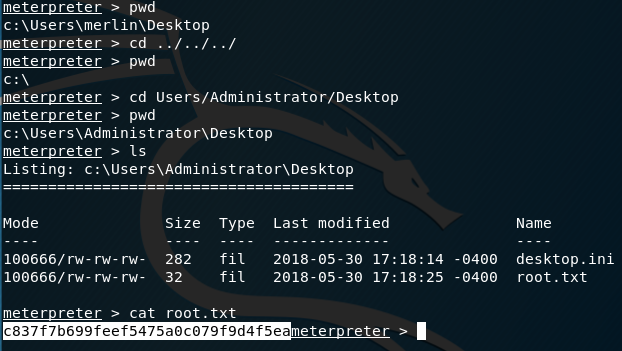

Resim 18 - Uygulama çalıştırma

#### RAMİN KARIMKHANI
